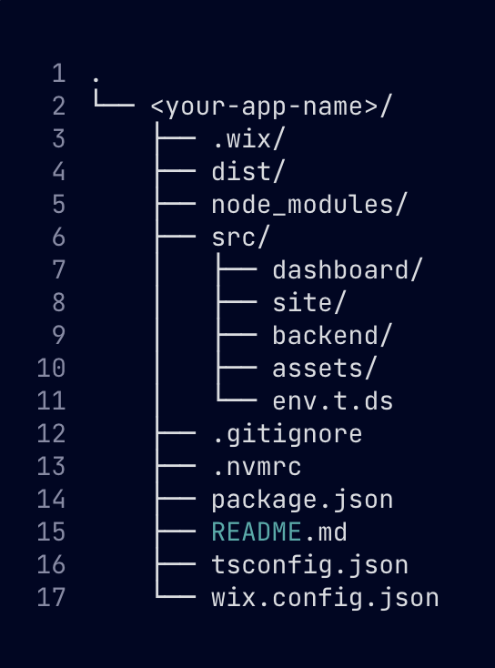
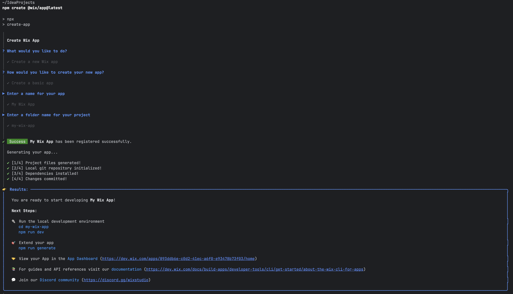
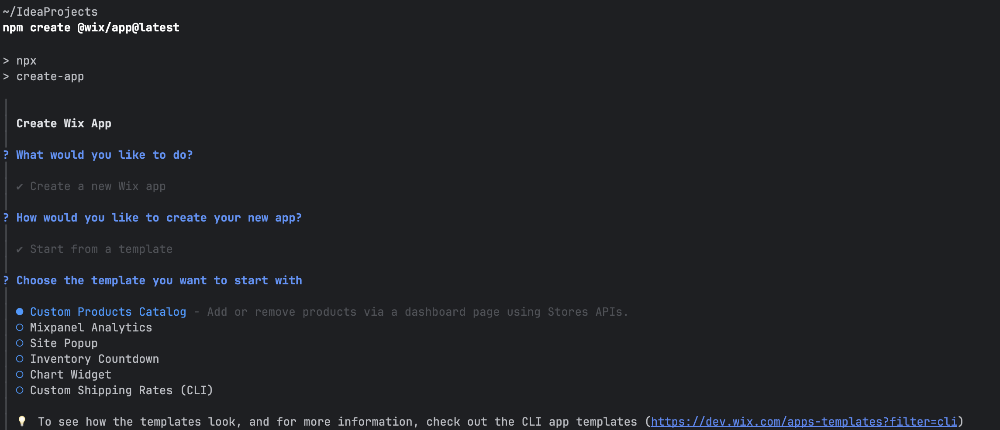
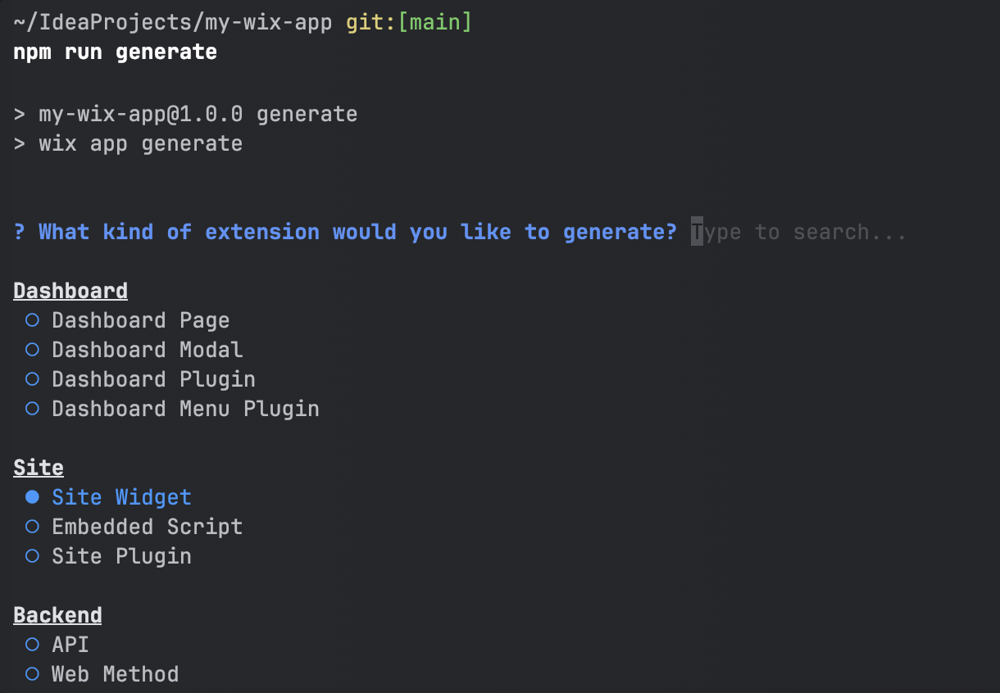
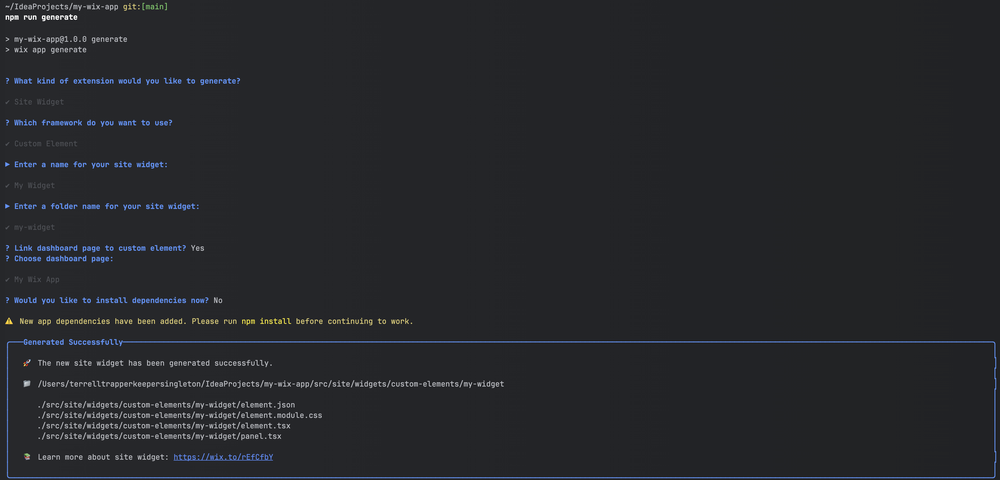

# My Wix Custom Element Widget 🚀

## Overview
This repository contains a custom Wix Studio app that demonstrates advanced widget development techniques, focusing on creating a seamless, interactive web experience within the Wix ecosystem.

## Prerequisites
- Node.js (v18+)
- Wix Studio
- npm or Yarn
- Basic understanding of React and TypeScript

## Project Structure


## Getting Started
### 1. Clone the Repository
```bash
git clone https://github.com/tmanundercover/my-wix-app.git
cd my-wix-app
```

### 2. Install Dependencies
```bash
npm install
# or
yarn install
```

### 3. [Generate Unique UUID](scripts/README.md)
#### NOTE: Do this or you will get a duplicate UUID error when you try to start the wix CLI

### 4. Copy the UUID and paste it into src/site/widgets/custom-elements/my-widget/element.json

## Wix CLI: Your Development Companion 🛠️
Once you run `npm run dev`, you're entering the world of the Wix CLI - hold your applause its basically react/typescript app development.

### What is the Wix CLI?
The Wix CLI is a game-changing tool that creates a custom developement path for wix sites. It's like having a personal assistant that handles the complex parts of Wix app creation.

🔗 **[Official Documentation: Wix CLI for Apps](https://dev.wix.com/docs/build-apps/develop-your-app/frameworks/wix-cli/about-the-wix-cli-for-apps)**

### Key CLI Features
- 🚀 Instant Local Development Server
- 🔄 Real-time Synchronization
- 🧪 Testing and Debugging Tools
- 📦 Simplified Deployment Workflow

### CLI Commands Cheat Sheet
```bash
# Start development server
npm run dev
```

### Pro Tip
- Always keep the Wix CLI updated

## Repository Generation and Setup
### This Repository as a Template?
🔗 **[GitHub Repository](https://github.com/tmanundercover/my-wix-app)**

**Pro Tip**: While this repository can be used as a template, I recommend running the Wix app creator and generator in your own environment with the latest version to ensure you have the most up-to-date configuration and dependencies.


### Wix App Creation Process
To create this Wix app, I used [Create Wix App](https://www.npmjs.com/package/@wix/create-app):
```bash
npm create @wix/app@latest
```

### App Type Selection

When creating the app, you have two primary options:
- **Basic App**: Creates an application with one dashboard page directory structure
- **Template-Based App**: Provides pre-configured templates demonstrating different Wix app elements

For this project, I selected a **Basic App**, which initializes a basic application structure with a single dashboard page.


🔗 **[Wix Application Directory Structure](https://dev.wix.com/docs/build-apps/develop-your-app/frameworks/wix-cli/get-started/cli-app-structure)**

The **Template-Based App** option:
The Chart Widget template is a good example for a Wix Custom Widget Element. 

[More info about the other templates]('https://dev.wix.com/apps-templates?filter=cli')

### Wix Application Generator
After initial setup, use the application generator to expand your project:
```bash
npm run generate
```
This command provides options to generate various directory and file structures, allowing you to add new components, pages, and elements to your Wix app. I selected Site Widget



[//]: # (## Configuration)
[//]: # (Rename `.env.example` to `.env` and add your Wix credentials:)
[//]: # (```env)
[//]: # (WIX_APP_ID=your-app-id)
[//]: # (WIX_APP_SECRET=your-app-secret)
[//]: # (```)

[//]: # (## Deployment)

[//]: # (1. Build the project)

[//]: # (2. Upload to Wix Studio)

[//]: # (3. Configure widget settings)

## Troubleshooting
- Ensure [UUID](scripts/README.md) is unique
- Check Wix Studio compatibility
- Verify TypeScript configurations

## License
MIT License

## About the Developer
**The Handsomest Nerd** - Breaking code and taking names 💻🤓

🔗 **[Personal Website](https://thehandsomestnerd.com)**
🔗 **[Blog](https://thehandsomestnerd.com/blog)**
🔗 **[LinkedIn](https://linkedin.com/in/thehandsomestnerd)**

 ...Nerdy Github Stats Coming Soon 📊

